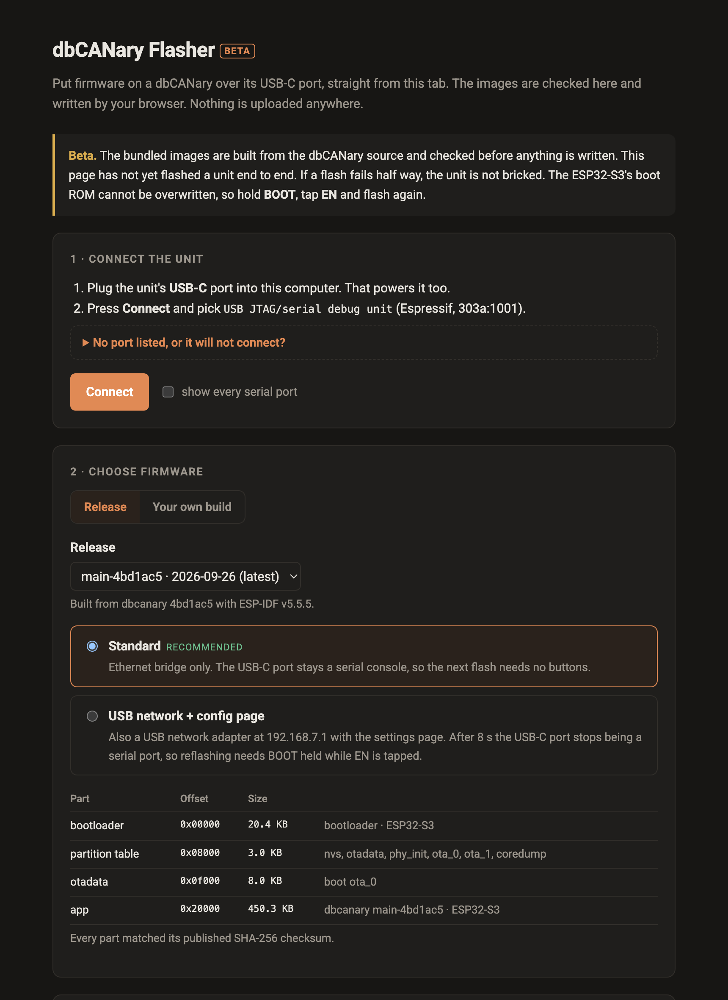

> **AI-assisted project.** This codebase was created with [Claude Code](https://claude.com/claude-code).
> **Not yet proven on a unit.** The image checks, the manifest and the MD5 used to verify each write
> are covered by tests against the real bundled images. The page has been driven in a browser up to
> the point of connecting. **No dbCANary has been flashed from it yet.**

# dbCANary Flasher

A static web page that puts firmware on a [dbCANary](https://stoatworks-labs.com/hardware/dbcanary/)
over its USB-C port, straight from a browser tab. No toolchain, no driver, no Python.

Live at **<https://dbcanary-flasher.stoatworks-labs.com>**. It needs Web Serial: desktop Chrome, Edge or Opera.



## What it does

| | |
|---|---|
| **Flash a release** | Pick a bundled release and a variant (*Standard*, or *USB network + config page*). Every part is checked against its published SHA-256 checksum before it is shown. |
| **Flash your own build** | Choose the `.bin` files from an ESP-IDF build directory. Each is identified by its **contents**, not its name, and put at the offset its kind belongs at. A lone `dbcanary.bin` gets a blank otadata written beside it, so the unit boots what you just wrote rather than whatever it last updated to over the air. |
| **Say what the unit is running** | On connect it reads the chip, MAC and flash size, and also otadata and the active slot's app descriptor, so you see the version before you overwrite it. |
| **Serial console** | Watch the unit boot after flashing. |

## What it refuses

Checked in the page before anything is written (`checkPlan()` in [src/image.ts](src/image.ts)), and
run over every bundled image by the test suite:

- a chip other than an ESP32-S3, or less than 8 MB of flash;
- an image built for another chip;
- an app whose project name is not `dbcanary`, unless you tick the override;
- a bootloader anywhere but `0x0`, or an app below `0x20000`;
- overlapping writes, offsets off a 4 KB sector, or anything past the end of flash.

Every write is verified by esptool's MD5 read-back.

## If a unit will not connect

A unit running the **USB network** firmware turns its USB-C port into a network adapter 8 s after
boot. After that there is no serial port. Hold **BOOT**, tap **EN**, release **BOOT** and connect.
The ESP32-S3's boot ROM cannot be overwritten, so a flash that fails half way is always recoverable
this way.

## Bundled firmware

`public/firmware/` holds release images and `manifest.json`. Only
`scripts/import-firmware.ts` writes them. It reads a build's own `flasher_args.json`, so no offset is
typed by hand, and it refuses anything the page would refuse:

```bash
node scripts/import-firmware.ts --build <idf build dir> --release main-<sha> \
  --variant standard --name "Standard" --summary "…" --commit <full sha> --recommended
```

The firmware images are built from the dbCANary source and are **not** covered by this repository's
MIT licence, which applies to the flasher itself.

## Develop

```bash
npm install
npm run dev      # vite
npm test         # vitest
npm run build    # tsc -b && vite build -> dist/
```

Built on [esptool-js](https://github.com/espressif/esptool-js) (Apache-2.0).
